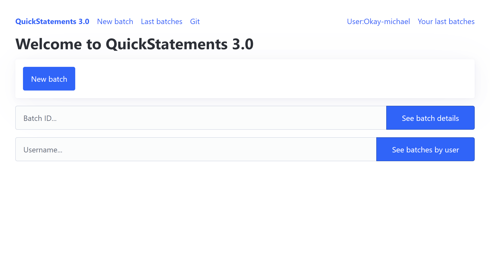

# QuickStatements 3.0 - HomePage Feature Documentation
## Table of content
- [QuickStatements 3.0 - HomePage Feature Documentation](#quickstatements-30---homepage-feature-documentation)
  - [Table of content](#table-of-content)
  - [Overview](#overview)
  - [Elements](#elements)
    - [1. **Header Section**](#1-header-section)
    - [2. **Main Content Section**](#2-main-content-section)
    - [3. **Batch Search Section**](#3-batch-search-section)
  - [Functional Notes](#functional-notes)
  - [Additional Details](#additional-details)

## Overview

This document explains the features available on the home page of the QuickStatements 3.0 web application. The design is simple and primarily focuses on user accessibility and ease of use.

*Overview of the QuickStatements 3.0 homepage.*

## Elements

### 1. **Header Section**

- **QuickStatements 3.0**: this button is displayed at the top left corner of the application in bold, blue text and dims a little when hovered upon by a mouse pointer.
  - URL: http://localhost:8765
- **Navigation Links**:
  - ***New Batch***: Navigates to the section where users can create a new batch.
    - URL: http://localhost:8765/batch/new/
  - ***Last Batches***: This button points nowhere currently, however, it's supposed to direct users to a view of the most recently processed batches but this feature is yet to be implemented.
    - URL: Currently not linked to any url yet
  - ***Git***: This button points back to the original github repository hosting the source code and other related resources for this application.
    - URL: https://github.com/WikiMovimentoBrasil/quickstatements3

- **User Information**:
  - Shows the current logged-in user (e.g **User:Okay-michael**).
    - URL: Currently not linked to any url yet 
  - **Your last batches**: This button is currently a dead link, however, it supposed to be a quick link to access the the details of current user's previously submitted batches. This feature too is yet to be implemented.
    - URL: Currently not linked to any url yet

### 2. **Main Content Section**

- **Welcome Message**: The page displays a greeting message, **Welcome to QuickStatements 3.0**, effectively introducing the user to the application.
- **Primary Action Button**:
  - A large blue button labeled **New batch** for users to create a new batch easily. This is the most prominent button on the interface.
    - URL: http://localhost:8765/batch/new/

### 3. **Batch Search Section**

This section allows users to search for specific batches by either batch ID or username. It consists of:

- **Batch ID Input Field**:
  - A text input box with a placeholder, **Batch ID...**, where users can enter the batch ID they want to search.
  - A blue button labeled **See batch details** that fetches and displays details about the batch when clicked.

- **Username Input Field**:
  - A text input box with a placeholder, **Username...**, where users can enter the username to search for batches associated with that user.
  - A blue button labeled **See batches by user** that displays all batches related to the entered username.

## Functional Notes

- The interface prioritizes clarity and functionality, with all essential actions (creating and searching batches) easily accessible through prominent buttons.
- The header provides quick navigation links, improving user accessibility and streamlining interaction.

## Additional Details

- **Color Scheme**: The interface uses a clean white background with blue elements (buttons, text) to highlight actionable items and navigation elements.
- **Responsiveness**: The page layout appears designed to accommodate different screen sizes, ensuring usability across various devices.

[Back to Top](#quickstatements-30---homepage-feature-documentation)
