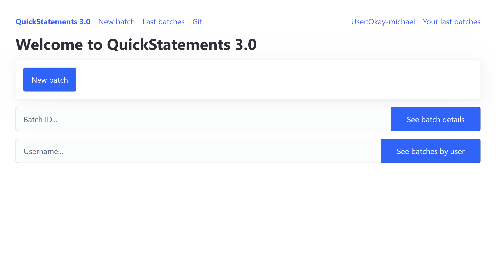

# QuickStatements 3.0 - HomePage Feature Documentation

## Table of Content
- [QuickStatements 3.0 - HomePage Feature Documentation](#quickstatements-30---homepage-feature-documentation)
  - [Table of Content](#table-of-content)
  - [Overview](#overview)
  - [Elements](#elements)
    - [1. **Header Section**](#1-header-section)
    - [2. **Main Content Section**](#2-main-content-section)
    - [3. **Batch Search Section**](#3-batch-search-section)
  - [Notes](#notes)

## Overview

This document outlines the features of the QuickStatements 3.0 homepage,
designed for user accessibility and ease of use.

*QuickStatements 3.0 homepage*

## Elements

### 1. **Header Section**

- **QuickStatements 3.0**: Displays at the top left and dims on hover.
  - ***URL***: `http://localhost:8765`
- **Navigation Links**:
  - ***New Batch***: Navigates to batch creation view
    - ***URL***: `http://localhost:8765/batch/new/`
  - ***Last Batches***: this feature is yet to be implemented, it is supposed to direct users to a view of the most recently processed batches.
    - URL: `Pending Implementation`
  - ***Git***: Links to this project's original github repository.
    - ***URL***: `https://github.com/WikiMovimentoBrasil/quickstatements3`

- **User Information**:
  - Shows the current/logged-in user (e.g **User:Okay-michael**).
    - ***URL***: `Pending Implementation`
  - **Your last batches**: this feature is yet to be implemented, In the
    future, it will allow the current users to quickly view their most recently submitted batches.
    - ***URL***: `Pending Implementation`

### 2. **Main Content Section**

- **Primary Action Button**:
  - **New batch**: A prominent blue button that navigates to new batch creation view
    - ***URL***: `http://localhost:8765/batch/new/`

### 3. **Batch Search Section**

Allows users to search for batches by ID or username.

- **Batch ID Search**:
  - Text input with placeholder, **Batch ID...**.
  - **See batch details**: this button retrieves batch details.
- **Username Search**:
  - Text input with placeholder, **Username...**.
  - **See batches by user**: this button displays batches related to the entered username.

## Notes

- Some functionalities are planned for future development and will be included in upcoming updates.
- **Responsiveness**: The layout adapts to various screen sizes, ensuring usability across devices.

[Back to Top](#quickstatements-30---homepage-feature-documentation)